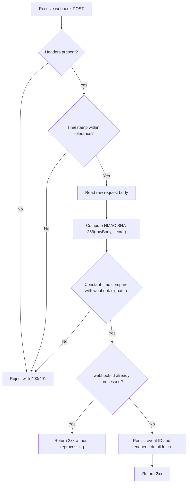

Fintoro API supports outbound webhooks for event-driven integrations. If you need to react to changes continuously and keep an external system synchronized with minimal delay, webhooks are the right mechanism. Fintoro sends an HTTP `POST` request whenever one of the selected business events occurs.
In Fintoro API, webhooks are designed as a thin trigger, not as a parallel snapshot API. The delivery payload always contains only the event identity, the event type, and a pointer to the resource through `resource.type` + `resource.id`. Your integration then fetches the full resource detail from the Fintoro API version it already uses.

## When to use webhooks

- when you need to react to create, update, or delete events without building change detection around frequent polling,
- when you want to keep a local cache or downstream system in sync only after a real change,
- when you want to separate event reception from the later fetch of the resource detail.

The recommended model is: receive the webhook, verify the signature, store `webhook-id` for deduplication, and only then fetch the resource detail from Fintoro API. Leave polling only as a backfill or reconciliation fallback, not as the primary trigger for change handling.

## Subscription management

Manage webhook subscriptions directly through the Fintoro API. The plaintext secret is only returned when the subscription is created or when you rotate it manually. For the exact CRUD contract, request schemas, and response payloads, use the [Webhook API reference](/en/api-reference).

In practice:

- you must store `plainTextSecret` securely from the create or rotate response,
- changing `url` or `subscribedEvents` does not rotate the secret automatically,
- `isActive = false` does not remove history, it only prevents new deliveries.

## Endpoint requirements

When you create or update a subscription, a syntactically valid HTTPS URL is not enough on its own. Fintoro validates the endpoint more strictly:

- `url` must use `https://`,
- `url` must not contain a username or password,
- the hostname must resolve to a public IP address,
- `localhost`, `.local`, private ranges, loopback, link-local, and other reserved addresses are rejected by the backend.

The same validation runs again immediately before the webhook is sent. If the endpoint no longer satisfies those checks, Fintoro does not send the request and marks the delivery as failed instead.

## Delivery payload

The webhook payload is intentionally thin:

```json
{
  "id": "7f4d1861-9f6a-4fa8-a8a7-f335d7a8d515",
  "type": "invoices.updated",
  "occurredAt": "2026-03-18T15:04:05Z",
  "resource": {
    "type": "invoice",
    "id": 301
  }
}
```

### Field semantics

| Field | Type | Meaning |
| --- | --- | --- |
| `id` | `string` | Unique webhook event ID. Use it for deduplication. |
| `type` | `string` | Business event name, for example `clients.created` or `orders.deleted`. |
| `occurredAt` | `string` | ISO 8601 timestamp in UTC representing when the event happened in Fintoro. |
| `resource.type` | `string` | Resource type such as `invoice`, `client`, or `warehouseOutboundReceipt`. |
| `resource.id` | `integer` | Resource ID in Fintoro. Use it to fetch the detail from Fintoro API. |

The payload does not include:

- an API version,
- an absolute or relative resource URL,
- a full resource snapshot,
- embedded lookups or nested business objects.

That contract stays stable even when your integration uses a specific API version or its own fetch strategy.

## Delivery headers

Every webhook request includes these headers:

| Header | Meaning |
| --- | --- |
| `webhook-id` | The same value as the payload field `id`. |
| `webhook-timestamp` | Unix timestamp in seconds at send time. |
| `webhook-signature` | HMAC SHA-256 signature of the raw JSON body using the subscription secret. |

`webhook-id` and `webhook-timestamp` are not assembled into a separate canonical string. The signature is calculated from the raw request body exactly as it was delivered.

## Signature verification

Signature verification should have four layers:

1. check that all required webhook headers are present,
2. check that `webhook-timestamp` is not too old or too far in the future,
3. compute HMAC SHA-256 over the raw request body and compare it in constant time,
4. deduplicate by `webhook-id` so that retries remain safe to process.

### Recommended flow



### Pseudocode

```text
rawBody = read_raw_request_body()
webhookId = header("webhook-id")
timestamp = integer(header("webhook-timestamp"))
providedSignature = header("webhook-signature")

if webhookId is missing or timestamp is missing or providedSignature is missing:
    return 400

if abs(current_unix_time() - timestamp) > 300:
    return 401

expectedSignature = hmac_sha256(rawBody, webhookSecret)

if not constant_time_equals(expectedSignature, providedSignature):
    return 401

if webhook_id_exists_in_dedup_store(webhookId):
    return 204

store_webhook_id(webhookId)
enqueue_fetch_job(parse_json(rawBody))

return 204
```

### JavaScript / Node.js-like example

```js
import crypto from 'node:crypto';

export async function handleFintoroWebhook(req, res) {
  // `req.rawBody` must contain the original raw request body before JSON parsing.
  const rawBody = req.rawBody.toString('utf8');
  const webhookId = req.get('webhook-id');
  const timestamp = Number(req.get('webhook-timestamp'));
  const providedSignature = req.get('webhook-signature');

  if (!webhookId || !timestamp || !providedSignature) {
    return res.status(400).json({ error: 'Missing webhook headers.' });
  }

  if (!isFreshWebhookTimestamp(timestamp)) {
    return res.sendStatus(401);
  }

  if (!isValidWebhookSignature(rawBody, providedSignature, process.env.FINTORO_WEBHOOK_SECRET)) {
    return res.sendStatus(401);
  }

  if (await hasProcessedWebhook(webhookId)) {
    return res.sendStatus(204);
  }

  const event = JSON.parse(rawBody);

  await storeWebhookId(webhookId);
  await enqueueFetchWebhookResourceDetail({
    webhookId,
    eventType: event.type,
    resourceType: event.resource.type,
    resourceId: event.resource.id,
    companyId: event.company.id,
  });

  return res.sendStatus(204);
}

function isFreshWebhookTimestamp(timestamp) {
  return Math.abs(Math.floor(Date.now() / 1000) - timestamp) <= 300;
}

function isValidWebhookSignature(rawBody, providedSignature, secret) {
  const expectedSignature = crypto
    .createHmac('sha256', secret)
    .update(rawBody)
    .digest('hex');

  if (expectedSignature.length !== providedSignature.length) {
    return false;
  }

  return crypto.timingSafeEqual(
    Buffer.from(expectedSignature, 'utf8'),
    Buffer.from(providedSignature, 'utf8'),
  );
}
```

## How to respond to a delivery

- Return `2xx` only after the request has been safely received, verified, and stored for downstream processing.
- If the signature or timestamp is invalid, return `401` or your receiver-specific auth failure.
- If a downstream dependency is temporarily unavailable and you want a retry, return a non-`2xx` status.
- If you accept the request and only enqueue internal work, `204 No Content` is perfectly fine.

Fintoro retries failed deliveries. That means your receiver should be:

- idempotent,
- resilient to duplicates,
- able to return `2xx` for an already processed `webhook-id`.

## Retry mechanism

Fintoro treats a delivery as failed when:

- the receiver returns a non-`2xx` HTTP status,
- the request times out,
- a network-level send error occurs.
- the endpoint no longer passes the pre-send URL, DNS, and IP safety validation.

The current delivery policy is:

| Parameter | Value | Notes |
| --- | --- | --- |
| HTTP timeout | `10` seconds | Applies to a single delivery request |
| Maximum attempts | `5` | 1 original attempt + 4 retries |
| Backoff strategy | exponential | After failures it waits about `10 s`, `100 s`, `1000 s`, and `10000 s` |

In practice, the typical sequence looks like this:

| Attempt | Timing | Notes |
| --- | --- | --- |
| 1 | immediately | first send right after the event is created |
| 2 | about `10 s` later | retry after the first failure |
| 3 | about `100 s` after the second attempt | second retry |
| 4 | about `1000 s` after the third attempt | third retry |
| 5 | about `10000 s` after the fourth attempt | final retry |

After all attempts are exhausted, the delivery is marked as finally failed. The subscription is not automatically disabled just because one or more deliveries failed.

From the receiver perspective, it is important to:

- never assume exactly-once delivery,
- expect the same `webhook-id` to arrive more than once,
- respond quickly and move heavier logic to your internal queue,
- return non-`2xx` only when you actually want Fintoro to retry the delivery.

## Thin payload and the follow-up detail fetch

Recommended integration flow:

1. receive the webhook and verify the signature,
2. deduplicate by `webhook-id`,
3. determine the correct detail endpoint from `type` and `resource`,
4. fetch the resource detail from the Fintoro API version used by your integration,
5. run business logic only on the fetched detail.

Examples:

- `clients.updated` + `resource.id = 42` → `GET /clients/42`
- `invoices.created` + `resource.id = 301` → `GET /invoices/301`
- `warehouse-outbound-receipts.deleted` + `resource.id = 88` → if the detail is already gone, process the delete locally from the event itself

For delete events, assume that the detail endpoint may no longer return the resource. In that case, the webhook event itself becomes the source of truth for the delete.

## Available events

### Master data

| Event | Resource | Description |
| --- | --- | --- |
| `clients.created` | `client` | A new client was created. |
| `clients.updated` | `client` | An existing client was changed. |
| `clients.deleted` | `client` | A client was deleted. |
| `suppliers.created` | `supplier` | A new supplier was created. |
| `suppliers.updated` | `supplier` | An existing supplier was changed. |
| `suppliers.deleted` | `supplier` | A supplier was deleted. |
| `bank-accounts.created` | `bankAccount` | A bank account was created. |
| `bank-accounts.updated` | `bankAccount` | A bank account was changed. |
| `bank-accounts.deleted` | `bankAccount` | A bank account was deleted. |

### CRM

| Event | Resource | Description |
| --- | --- | --- |
| `business-case-statuses.created` | `businessCaseStatus` | A new business-case status was created. |
| `business-case-statuses.updated` | `businessCaseStatus` | A business-case status was changed. |
| `business-case-statuses.deleted` | `businessCaseStatus` | A business-case status was deleted. |
| `business-cases.created` | `businessCase` | A new business case was created. |
| `business-cases.updated` | `businessCase` | A business case was changed. |
| `business-cases.deleted` | `businessCase` | A business case was deleted. |
| `contact-activity-logs.created` | `contactActivityLog` | A CRM event was created. |
| `contact-activity-logs.updated` | `contactActivityLog` | A CRM event was changed. |
| `contact-activity-logs.deleted` | `contactActivityLog` | A CRM event was deleted. |

### Warehouses and catalog

| Event | Resource | Description |
| --- | --- | --- |
| `warehouses.created` | `warehouse` | A new warehouse was created. |
| `warehouses.updated` | `warehouse` | A warehouse was changed. |
| `warehouses.deleted` | `warehouse` | A warehouse was deleted. |
| `warehouse-inbound-receipts.created` | `warehouseInboundReceipt` | A warehouse inbound receipt was created. |
| `warehouse-inbound-receipts.updated` | `warehouseInboundReceipt` | A warehouse inbound receipt was changed. |
| `warehouse-inbound-receipts.deleted` | `warehouseInboundReceipt` | A warehouse inbound receipt was deleted. |
| `warehouse-outbound-receipts.created` | `warehouseOutboundReceipt` | A warehouse outbound receipt was created. |
| `warehouse-outbound-receipts.updated` | `warehouseOutboundReceipt` | A warehouse outbound receipt was changed. |
| `warehouse-outbound-receipts.deleted` | `warehouseOutboundReceipt` | A warehouse outbound receipt was deleted. |
| `price-list-items.created` | `priceListItem` | A new price-list or warehouse item was created. |
| `price-list-items.updated` | `priceListItem` | A price-list or warehouse item was changed. |
| `price-list-items.deleted` | `priceListItem` | A price-list or warehouse item was deleted. |

### Documents

| Event | Resource | Description |
| --- | --- | --- |
| `invoices.created` | `invoice` | An invoice was created. |
| `invoices.updated` | `invoice` | An invoice was changed. |
| `invoices.deleted` | `invoice` | An invoice was deleted. |
| `invoices.paid` | `invoice` | An invoice became fully paid after a payment was recorded. |
| `credit-notes.created` | `creditNote` | A credit note was created. |
| `credit-notes.updated` | `creditNote` | A credit note was changed. |
| `credit-notes.deleted` | `creditNote` | A credit note was deleted. |
| `credit-notes.paid` | `creditNote` | A credit note became fully paid after a payment was recorded. |
| `received-invoices.paid` | `receivedInvoice` | A received invoice became fully paid after a payment was recorded. |
| `received-receipts.paid` | `receivedReceipt` | A received receipt became fully paid after a payment was recorded. |
| `proformas.created` | `proforma` | A proforma was created. |
| `proformas.updated` | `proforma` | A proforma was changed. |
| `proformas.deleted` | `proforma` | A proforma was deleted. |
| `proformas.paid` | `proforma` | A proforma became fully paid after a payment was recorded. |
| `orders.created` | `order` | An order was created. |
| `orders.updated` | `order` | An order was changed. |
| `orders.deleted` | `order` | An order was deleted. |
| `quotations.created` | `quotation` | A quotation was created. |
| `quotations.updated` | `quotation` | A quotation was changed. |
| `quotations.deleted` | `quotation` | A quotation was deleted. |
| `document-payments.created` | `documentPayment` | A document payment was recorded. |
| `document-payments.deleted` | `documentPayment` | A document payment was deleted. |

## Production recommendations

- do not run heavy business logic directly in the receiver HTTP thread,
- persist the raw payload and `webhook-id` before downstream processing,
- rotate secrets in a controlled way and coordinate rollout with the receiver,
- monitor retry patterns and repeated non-`2xx` responses as an indicator of a receiver-side incident,
- log `webhook-id`, `type`, `resource.type`, `resource.id`, and the `X-Request-Id` from the later resource fetch,
- for delete events, do not assume the detail endpoint can still return the deleted resource.

## Related sections

- [Getting started](/en/getting-started)
- [Authentication](/en/authentication)
- [API conventions](/en/conventions)
- [Errors and idempotency](/en/errors-and-idempotency)
- [Webhook API reference](/en/api-reference)
