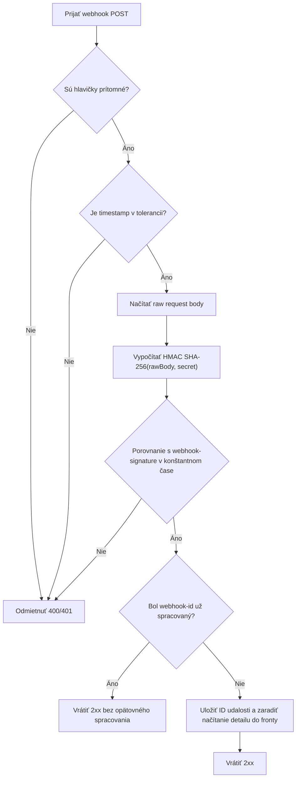

# Webhooky

Fintoro Public API podporuje odchádzajúce webhooky pre integrácie riadené udalosťami. Ak potrebujete na zmeny reagovať priebežne a držať externý systém zosynchronizovaný s čo najmenším oneskorením, webhooky sú správny mechanizmus. Fintoro Vám odošle HTTP `POST` request vždy, keď nastane vybraná obchodná udalosť.

Webhooky v Public API sú navrhnuté ako tenký trigger, nie ako paralelný snapshot API. Payload doručenia vždy obsahuje len identitu udalosti, jej typ a odkaz na resource cez `resource.type` + `resource.id`. Detail si následne dotiahnete z Public API vo verzii, ktorú používa Vaša integrácia.

## Kedy webhooky použiť

- keď potrebujete reagovať na vytvorenie, úpravu alebo zmazanie bez toho, aby ste stav zmien stavali na periodickom dotazovaní,
- keď si chcete lokálnu cache alebo downstream systém synchronizovať len pri reálnej zmene,
- keď potrebujete oddeliť prijatie udalosti od následného načítania detailu resource-u.

Odporúčaný model je: webhook prijmete, overíte podpis, uložíte `webhook-id` na deduplikáciu a až potom si načítate detail resource-u z Public API. Periodické dotazovanie nechajte len ako backfill alebo kontrolný fallback, nie ako primárny trigger zmien.

## Správa odberov

Odbery webhookov spravujete priamo cez Public API. Secret v otvorenej podobe sa zobrazí iba pri vytvorení odberu alebo pri jeho manuálnej rotácii. Presný CRUD kontrakt, request schémy a response payloady nájdete priamo v [Webhook API referencii](./api-reference/index.mdx).

Prakticky to znamená:

- hodnotu `plainTextSecret` si musíte bezpečne uložiť pri create alebo rotate odpovedi,
- zmena `url` ani `subscribedEvents` secret automaticky nerotuje,
- `isActive = false` historické záznamy nevypína, len zastaví nové pokusy o doručenie.

## Požiadavky na endpoint

Pri ukladaní alebo update odberu nestačí, aby `url` bola len syntakticky validná HTTPS adresa. Fintoro endpoint overuje prísnejšie:

- `url` musí používať `https://`,
- `url` nesmie obsahovať používateľské meno ani heslo,
- hostname sa musí resolvnuť na verejnú IP adresu,
- `localhost`, `.local`, privátne rozsahy, loopback, link-local a iné rezervované adresy backend odmietne.

Tá istá kontrola prebehne znovu aj tesne pred samotným odoslaním webhooku. Ak endpoint medzičasom prestane spĺňať tieto podmienky, Fintoro request vôbec neodošle a delivery označí ako neúspešné.

## Payload doručenia

Payload webhooku je zámerne tenký:

```json
{
  "id": "7f4d1861-9f6a-4fa8-a8a7-f335d7a8d515",
  "type": "invoices.updated",
  "occurredAt": "2026-03-18T15:04:05Z",
  "resource": {
    "type": "invoice",
    "id": 301
  }
}
```

### Význam polí

| Pole | Typ | Význam |
| --- | --- | --- |
| `id` | `string` | Unikátne ID webhook udalosti. Použite ho na deduplikáciu. |
| `type` | `string` | Názov obchodnej udalosti, napríklad `clients.created` alebo `orders.deleted`. |
| `occurredAt` | `string` | ISO 8601 timestamp v UTC, kedy udalosť vznikla vo Fintoro. |
| `resource.type` | `string` | Typ resource-u, napríklad `invoice`, `client` alebo `warehouseOutboundReceipt`. |
| `resource.id` | `integer` | ID resource-u vo Fintoro. Detail si podľa neho načítate z Public API. |

Payload neobsahuje:

- verziu API,
- absolútnu ani relatívnu URL na resource,
- plný snapshot resource-u,
- vnorené lookupy alebo vnorené obchodné objekty.

Takýto kontrakt ostáva stabilný aj vtedy, keď Vaša integrácia používa konkrétnu verziu detailových endpointov alebo vlastnú stratégiu načítania.

## Delivery headery

Každý webhook request obsahuje tieto hlavičky:

| Header | Význam |
| --- | --- |
| `webhook-id` | Rovnaká hodnota ako pole `id` v payloade. |
| `webhook-timestamp` | Unix timestamp v sekundách v čase odoslania. |
| `webhook-signature` | HMAC SHA-256 podpis raw JSON body pomocou secretu odberu. |

`webhook-id` a `webhook-timestamp` nepodpisujete samostatne do vlastného kanonického reťazca. Podpis sa počíta nad raw request body presne v tvare, v akom prišiel.

## Overenie podpisu

Overenie requestu by malo mať štyri vrstvy:

1. skontrolujte, že request obsahuje všetky webhook headery,
2. skontrolujte, že `webhook-timestamp` nie je príliš starý alebo príliš ďaleko v budúcnosti,
3. vypočítajte HMAC SHA-256 nad raw request body a porovnajte ho v constant-time režime,
4. deduplikujte podľa `webhook-id`, aby ste vedeli bezpečne spracovať opakované doručenie.

### Odporúčaný flow



### Pseudokód

```text
rawBody = read_raw_request_body()
webhookId = header("webhook-id")
timestamp = integer(header("webhook-timestamp"))
providedSignature = header("webhook-signature")

if webhookId is missing or timestamp is missing or providedSignature is missing:
    return 400

if abs(current_unix_time() - timestamp) > 300:
    return 401

expectedSignature = hmac_sha256(rawBody, webhookSecret)

if not constant_time_equals(expectedSignature, providedSignature):
    return 401

if webhook_id_exists_in_dedup_store(webhookId):
    return 204

store_webhook_id(webhookId)
enqueue_fetch_job(parse_json(rawBody))

return 204
```

### JavaScript / Node.js-like príklad

```js
import crypto from 'node:crypto';

export async function handleFintoroWebhook(req, res) {
  // `req.rawBody` musí obsahovať pôvodný raw request body pred JSON parsingom.
  const rawBody = req.rawBody.toString('utf8');
  const webhookId = req.get('webhook-id');
  const timestamp = Number(req.get('webhook-timestamp'));
  const providedSignature = req.get('webhook-signature');

  if (!webhookId || !timestamp || !providedSignature) {
    return res.status(400).json({ error: 'Missing webhook headers.' });
  }

  if (!isFreshWebhookTimestamp(timestamp)) {
    return res.sendStatus(401);
  }

  if (!isValidWebhookSignature(rawBody, providedSignature, process.env.FINTORO_WEBHOOK_SECRET)) {
    return res.sendStatus(401);
  }

  if (await hasProcessedWebhook(webhookId)) {
    return res.sendStatus(204);
  }

  const event = JSON.parse(rawBody);

  await storeWebhookId(webhookId);
  await enqueueFetchWebhookResourceDetail({
    webhookId,
    eventType: event.type,
    resourceType: event.resource.type,
    resourceId: event.resource.id,
    companyId: event.company.id,
  });

  return res.sendStatus(204);
}

function isFreshWebhookTimestamp(timestamp) {
  return Math.abs(Math.floor(Date.now() / 1000) - timestamp) <= 300;
}

function isValidWebhookSignature(rawBody, providedSignature, secret) {
  const expectedSignature = crypto
    .createHmac('sha256', secret)
    .update(rawBody)
    .digest('hex');

  if (expectedSignature.length !== providedSignature.length) {
    return false;
  }

  return crypto.timingSafeEqual(
    Buffer.from(expectedSignature, 'utf8'),
    Buffer.from(providedSignature, 'utf8'),
  );
}
```

## Ako odpovedať na delivery

- Vráťte `2xx` až keď ste request bezpečne prijali, overili a uložili na ďalšie spracovanie.
- Ak signature alebo timestamp nesedia, vráťte `401` alebo inú vlastnú autentifikačnú chybu podľa politiky prijímača webhookov.
- Pri dočasnom downstream probléme vráťte non-`2xx`, ak chcete, aby systém webhook zopakoval.
- Ak request prijmete, ale ešte len zaraďujete interné spracovanie do fronty, `204 No Content` je úplne v poriadku.

Fintoro používa opakované doručovanie pri neúspešnom doručení. Preto prijímač webhookov musí byť:

- idempotentný,
- odolný voči duplicitám,
- schopný vrátiť `2xx` aj pri znovu doručenom už spracovanom `webhook-id`.

## Mechanizmus opakovania

Fintoro považuje doručenie za neúspešné, keď:

- prijímač webhookov vráti non-`2xx` HTTP status,
- request timeoutne,
- nastane sieťová chyba pri odoslaní.
- endpoint pri predodovacej kontrole už neprejde bezpečnostnou validáciou URL, DNS a IP adresy.

Aktuálna politika doručovania je:

| Parameter | Hodnota | Poznámka |
| --- | --- | --- |
| HTTP timeout | `10` sekúnd | Týka sa jedného delivery requestu |
| Maximálny počet pokusov | `5` | 1 pôvodný pokus + 4 retry pokusy |
| Backoff stratégia | exponenciálna | Po zlyhaniach čaká približne `10 s`, `100 s`, `1000 s` a `10000 s` |

Prakticky to znamená tento typický priebeh:

| Pokus | Kedy | Poznámka |
| --- | --- | --- |
| 1 | okamžite | prvé odoslanie po vzniku udalosti |
| 2 | približne po `10 s` | retry po prvom neúspechu |
| 3 | približne po `100 s` od druhého pokusu | druhý retry |
| 4 | približne po `1000 s` od tretieho pokusu | tretí retry |
| 5 | približne po `10000 s` od štvrtého pokusu | posledný retry |

Po vyčerpaní všetkých pokusov sa doručenie označí ako finálne neúspešné. Odber sa automaticky nevypína len preto, že jeden alebo viac pokusov zlyhalo.

Z pohľadu prijímača webhookov je dôležité:

- nepredpokladať exactly-once delivery,
- rátať s tým, že ten istý `webhook-id` môže prísť opakovane,
- odpovedať rýchlo a ťažšiu logiku delegovať do internej fronty,
- vracať non-`2xx` len vtedy, keď naozaj chcete, aby Fintoro doručenie zopakovalo.

## Thin payload a následné načítanie detailu

Odporúčaný integračný flow:

1. prijmite webhook a overte podpis,
2. deduplikujte podľa `webhook-id`,
3. podľa `type` a `resource` určite, ktorý endpoint detailu potrebujete,
4. detail si načítajte z Public API vo verzii, ktorú používa Vaša integrácia,
5. business logiku robte až nad načítaným detailom.

Príklady:

- `clients.updated` + `resource.id = 42` → `GET /clients/42`
- `invoices.created` + `resource.id = 301` → `GET /invoices/301`
- `warehouse-outbound-receipts.deleted` + `resource.id = 88` → ak už detail neexistuje, spracujte delete lokálne len podľa payloadu eventu

Pri delete eventoch rátajte s tým, že detail resource-u už nemusí byť dostupný. V takom prípade je zdrojom pravdy samotný webhook event a Vaše lokálne mapovanie.

## Dostupné eventy

### Master data

| Event | Resource | Popis |
| --- | --- | --- |
| `clients.created` | `client` | Nový klient bol vytvorený. |
| `clients.updated` | `client` | Existujúci klient bol zmenený. |
| `clients.deleted` | `client` | Klient bol zmazaný. |
| `suppliers.created` | `supplier` | Nový dodávateľ bol vytvorený. |
| `suppliers.updated` | `supplier` | Existujúci dodávateľ bol zmenený. |
| `suppliers.deleted` | `supplier` | Dodávateľ bol zmazaný. |
| `bank-accounts.created` | `bankAccount` | Bankový účet bol vytvorený. |
| `bank-accounts.updated` | `bankAccount` | Bankový účet bol zmenený. |
| `bank-accounts.deleted` | `bankAccount` | Bankový účet bol zmazaný. |

### CRM

| Event | Resource | Popis |
| --- | --- | --- |
| `business-case-statuses.created` | `businessCaseStatus` | Bol vytvorený nový stav obchodného prípadu. |
| `business-case-statuses.updated` | `businessCaseStatus` | Stav obchodného prípadu bol zmenený. |
| `business-case-statuses.deleted` | `businessCaseStatus` | Stav obchodného prípadu bol zmazaný. |
| `business-cases.created` | `businessCase` | Bol vytvorený nový obchodný prípad. |
| `business-cases.updated` | `businessCase` | Obchodný prípad bol zmenený. |
| `business-cases.deleted` | `businessCase` | Obchodný prípad bol zmazaný. |
| `contact-activity-logs.created` | `contactActivityLog` | Bola vytvorená CRM udalosť. |
| `contact-activity-logs.updated` | `contactActivityLog` | CRM udalosť bola zmenená. |
| `contact-activity-logs.deleted` | `contactActivityLog` | CRM udalosť bola zmazaná. |

### Sklady a katalóg

| Event | Resource | Popis |
| --- | --- | --- |
| `warehouses.created` | `warehouse` | Bol vytvorený nový sklad. |
| `warehouses.updated` | `warehouse` | Sklad bol zmenený. |
| `warehouses.deleted` | `warehouse` | Sklad bol zmazaný. |
| `warehouse-inbound-receipts.created` | `warehouseInboundReceipt` | Bola vytvorená skladová príjemka. |
| `warehouse-inbound-receipts.updated` | `warehouseInboundReceipt` | Skladová príjemka bola zmenená. |
| `warehouse-inbound-receipts.deleted` | `warehouseInboundReceipt` | Skladová príjemka bola zmazaná. |
| `warehouse-outbound-receipts.created` | `warehouseOutboundReceipt` | Bola vytvorená skladová výdajka. |
| `warehouse-outbound-receipts.updated` | `warehouseOutboundReceipt` | Skladová výdajka bola zmenená. |
| `warehouse-outbound-receipts.deleted` | `warehouseOutboundReceipt` | Skladová výdajka bola zmazaná. |
| `price-list-items.created` | `priceListItem` | Bola vytvorená nová skladová alebo cenníková položka. |
| `price-list-items.updated` | `priceListItem` | Skladová alebo cenníková položka bola zmenená. |
| `price-list-items.deleted` | `priceListItem` | Skladová alebo cenníková položka bola zmazaná. |

### Doklady

| Event | Resource | Popis |
| --- | --- | --- |
| `invoices.created` | `invoice` | Bola vytvorená faktúra. |
| `invoices.updated` | `invoice` | Faktúra bola zmenená. |
| `invoices.deleted` | `invoice` | Faktúra bola zmazaná. |
| `invoices.paid` | `invoice` | Faktúra sa po zaevidovaní úhrady stala plne uhradenou. |
| `credit-notes.created` | `creditNote` | Bol vytvorený dobropis. |
| `credit-notes.updated` | `creditNote` | Dobropis bol zmenený. |
| `credit-notes.deleted` | `creditNote` | Dobropis bol zmazaný. |
| `credit-notes.paid` | `creditNote` | Dobropis sa po zaevidovaní úhrady stal plne uhradeným. |
| `received-invoices.paid` | `receivedInvoice` | Prijatá faktúra sa po zaevidovaní úhrady stala plne uhradenou. |
| `received-receipts.paid` | `receivedReceipt` | Prijatý bloček sa po zaevidovaní úhrady stal plne uhradeným. |
| `proformas.created` | `proforma` | Bola vytvorená zálohová faktúra. |
| `proformas.updated` | `proforma` | Zálohová faktúra bola zmenená. |
| `proformas.deleted` | `proforma` | Zálohová faktúra bola zmazaná. |
| `proformas.paid` | `proforma` | Zálohová faktúra sa po zaevidovaní úhrady stala plne uhradenou. |
| `orders.created` | `order` | Bola vytvorená objednávka. |
| `orders.updated` | `order` | Objednávka bola zmenená. |
| `orders.deleted` | `order` | Objednávka bola zmazaná. |
| `quotations.created` | `quotation` | Bola vytvorená cenová ponuka. |
| `quotations.updated` | `quotation` | Cenová ponuka bola zmenená. |
| `quotations.deleted` | `quotation` | Cenová ponuka bola zmazaná. |
| `document-payments.created` | `documentPayment` | Bola zaevidovaná úhrada dokladu. |
| `document-payments.deleted` | `documentPayment` | Úhrada dokladu bola zmazaná. |

## Praktické odporúčania pre produkciu

- nepúšťajte ťažkú business logiku priamo vo vlákne HTTP requestu prijímača webhookov,
- raw payload aj `webhook-id` si ukladajte pred ďalším spracovaním,
- secret rotujte kontrolovane a s plánom výmeny na strane prijímača webhookov,
- sledujte retry vzory a opakované non-`2xx` odpovede ako indikátor incidentu na strane prijímača webhookov,
- logujte si `webhook-id`, `type`, `resource.type`, `resource.id` a `X-Request-Id` z následného načítania detailu,
- pri delete eventoch sa nespoliehajte na to, že detail endpoint ešte stále vráti resource.

## Súvisiace sekcie

- [Začíname](./getting-started.md)
- [Autentifikácia](./authentication.md)
- [Konvencie API](./conventions.md)
- [Chyby a idempotencia](./errors-and-idempotency.md)
- [Webhook API referencia](./api-reference/index.mdx)
